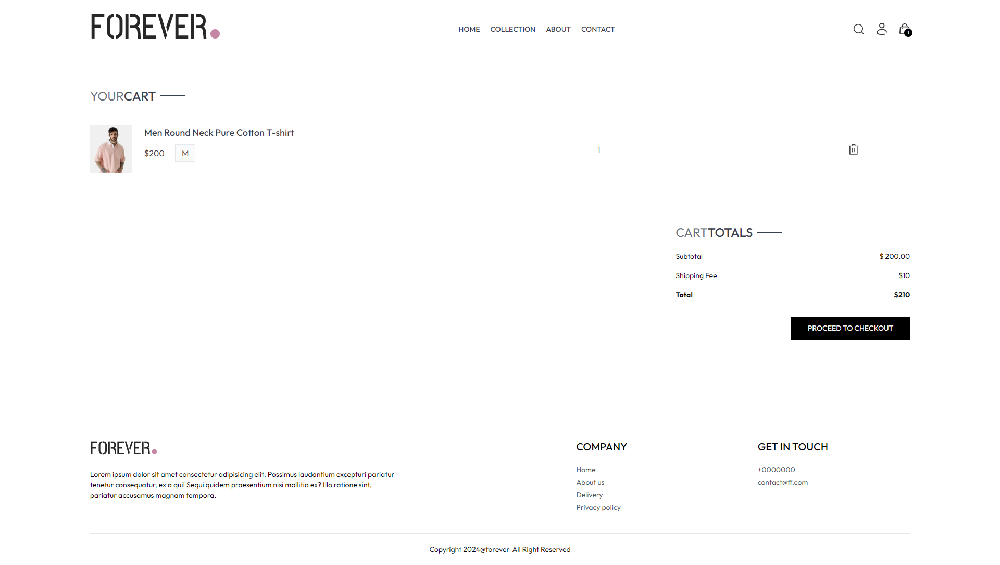
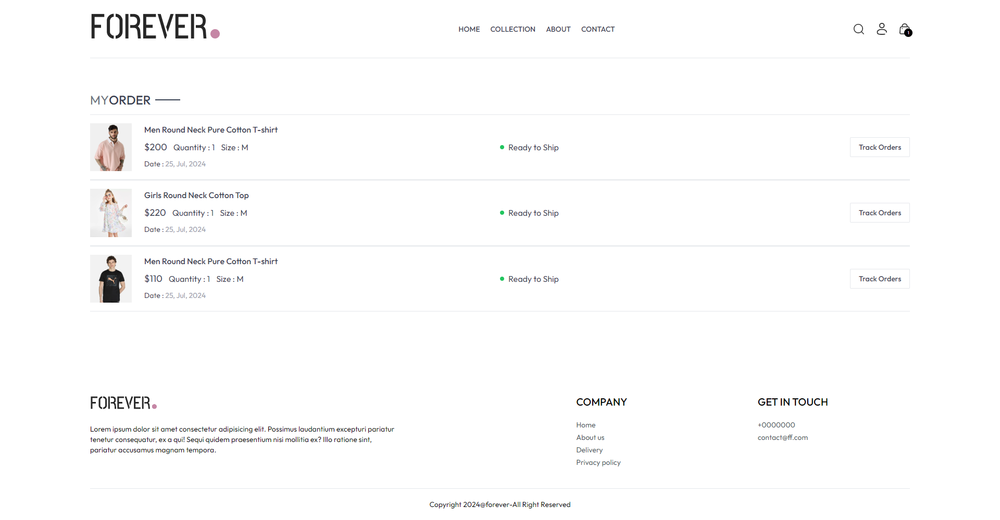

# My E-commerce Site with React.js and Tailwind CSS

This e-commerce site is built with **React.js** and styled using **Tailwind CSS**. The platform features a modern, responsive user interface with efficient product management and an integrated shopping cart system. It includes various sections such as a homepage, product collection page, product details, cart, and order tracking. Each component is designed to offer a seamless shopping experience while maintaining a clean, minimalistic design.

## Screenshots

### Homepage

### Collection Page

### Checkout Page

### Product Details Page

### Cart Page

### Track Orders Page

## Features
- Modern responsive design
- Product management system
- Shopping cart integration
- Order tracking

Give a Star ⭐
If you like this project, please consider giving it a star on GitHub! Your support is much appreciated!

This includes a "Give a Star" section to remind users to star your repository if they find it helpful.
